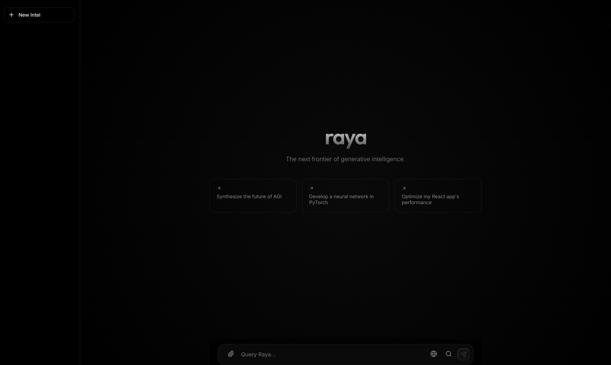
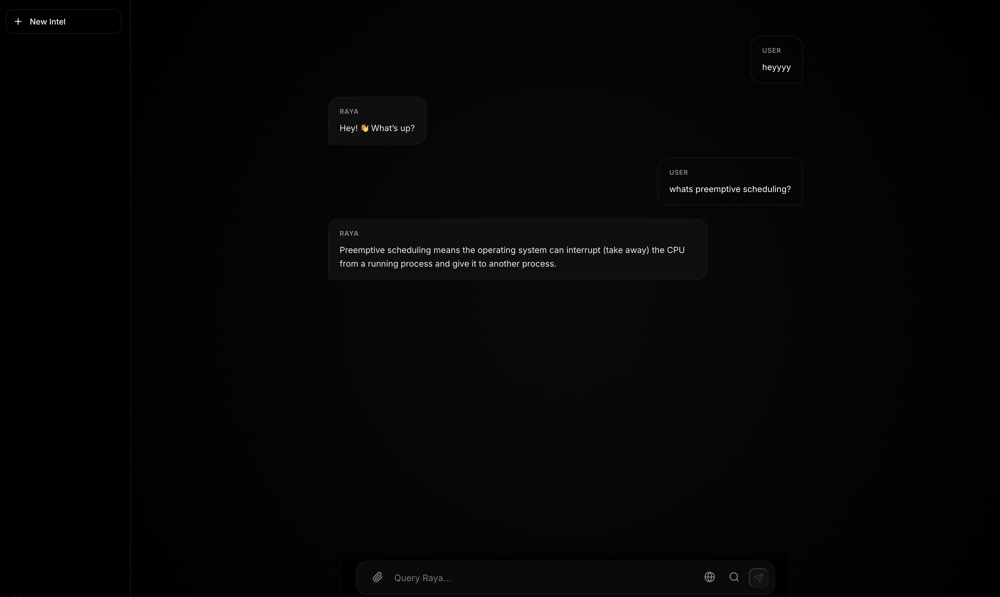

# Raya AI

A 124M parameter transformer I built from scratch. Features a clean UI and a solid training pipeline to reduce repetitive/noisy outputs.



## What's Inside

- **Custom Transformer**: 12-layer decoder with causal masking
- **Clean UI**: Dark-themed React frontend with smooth animations
- **Better Training**: Aggressive data cleaning to reduce noise and repetition
- **FastAPI Backend**: Simple inference server



## Tech Stack

- Backend: PyTorch, FastAPI, Tiktoken
- Frontend: React, Vite, vanilla CSS
- Works on: CUDA GPUs, Apple Silicon (MPS), or CPU

## File Structure

```
.
├── app.py               # Backend API
├── model.py             # Transformer architecture
├── config.py            # Settings
├── dataset.py           # Data loading + cleaning
├── train.py             # Training loop
├── raya_colab_trainer.py # One-file Colab script
├── tokenizer.py         # GPT-2 tokenizer wrapper
├── code_gpt_e3.pt       # Model weights (650MB)
└── frontend/            # React UI
```

## Getting Started

### Run the Backend
```bash
pip install torch fastapi uvicorn tiktoken
python app.py
```

### Run the Frontend
```bash
cd frontend
npm install
npm run dev
```

### Train Your Own Model
Upload `raya_colab_trainer.py` to Google Colab and run it. It'll train on WikiText-103 and save checkpoints. Download `raya_e5.pt` and drop it in the project folder.

Or train locally:
```bash
python train.py
```

## Notes

The training script includes aggressive cleaning to filter out repetitive patterns and noise. I switched to WikiText-103 (instead of WikiText-2) because it has 100x more data, which helps reduce repetition issues.
