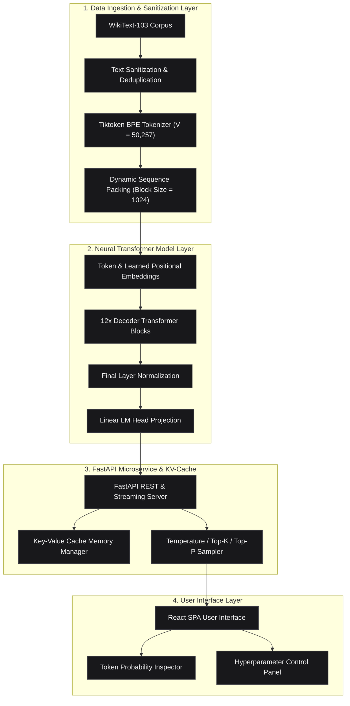
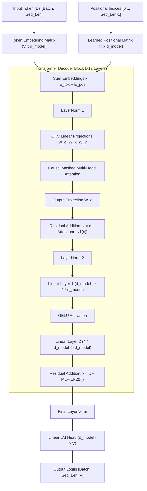
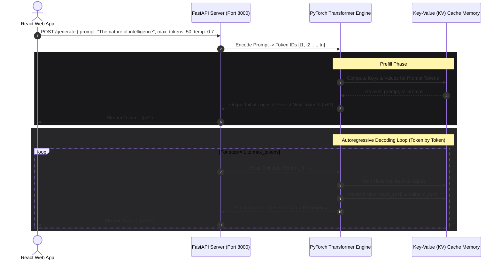

# Raya AI: 124M Parameter Transformer Model from Scratch

Raya AI is an industrial-grade, 124-million parameter decoder-only transformer language model engineered entirely from first principles. Designed to bridge state-of-the-art neural architecture research with production deployment, Raya AI features zero pre-trained weights, custom BPE tokenization, a 12-layer decoder architecture, dynamic sequence packing on WikiText-103, a high-throughput FastAPI inference server with key-value (KV) caching, and a React-driven user interface.

---

## Executive Summary and Technical Goals

### Core Objectives
1. **First-Principles Neural Architecture**: Construct a functional 124M parameter transformer model in PyTorch without relying on pre-trained HuggingFace or OpenAI weights.
2. **End-to-End Pipeline**: Implement raw text ingestion, data sanitization, Byte-Pair Encoding (BPE), causal self-attention, autoregressive text generation, and web deployment.
3. **Optimized Inference**: Integrate key-value (KV) attention caching within the generation loop to reduce autoregressive sampling complexity from quadratic to linear relative to context length.
4. **Full-Stack Interface**: Build a responsive React web client connected via asynchronous HTTP streaming to monitor token probabilities, generation latency, and hyperparameter controls.

---

## System Architecture


```mermaid
graph TD
    subgraph Data_Pipeline ["1. Data Ingestion & Sanitization Layer"]
        RAW["WikiText-103 Corpus"] --> CLEAN["Text Sanitization & Deduplication"]
        CLEAN --> BPE["Tiktoken BPE Tokenizer (V = 50,257)"]
        BPE --> PACK["Dynamic Sequence Packing (Block Size = 1024)"]
    end

    subgraph Neural_Engine ["2. Neural Transformer Model Layer"]
        PACK --> EMB["Token & Learned Positional Embeddings"]
        EMB --> BLOCKS["12x Decoder Transformer Blocks"]
        BLOCKS --> LN["Final Layer Normalization"]
        LN --> HEAD["Linear LM Head Projection"]
    end

    subgraph Inference_Service ["3. FastAPI Microservice & KV-Cache"]
        HEAD --> FASTAPI["FastAPI REST & Streaming Server"]
        FASTAPI --> KV["Key-Value Cache Memory Manager"]
        FASTAPI --> SAMPLER["Temperature / Top-K / Top-P Sampler"]
    end

    subgraph Frontend_Client ["4. User Interface Layer"]
        SAMPLER --> REACT["React SPA User Interface"]
        REACT --> HEATMAP["Token Probability Inspector"]
        REACT --> CONTROLS["Hyperparameter Control Panel"]
    end

    classDef default fill:#18181b,stroke:#3f3f46,stroke-width:1.5px,color:#f4f4f5;
    classDef highlight fill:#09090b,stroke:#6366f1,stroke-width:1.5px,color:#ffffff;
```

---

## Neural Architecture Specifications

### Model Parameters and Hyperparameters

| Metric / Parameter | Value / Configuration | Description |
| :--- | :--- | :--- |
| **Total Parameters** | $124,439,808$ ($124\text{M}$) | 12-layer decoder-only transformer architecture |
| **Vocabulary Size ($V$)** | $50,257$ | Byte-Pair Encoding (BPE) vocabulary |
| **Context Window ($T$)** | $1,024$ tokens | Maximum sequence block length |
| **Embedding Dimension ($d_{\text{model}}$)** | $768$ | Hidden state vector dimension |
| **Number of Layers ($L$)** | $12$ | Stacked transformer decoder blocks |
| **Attention Heads ($n_{\text{head}}$)** | $12$ | Multi-head self-attention heads |
| **Head Dimension ($d_k$)** | $64$ | $d_{\text{model}} / n_{\text{head}} = 768 / 12$ |
| **Feed-Forward Dimension ($d_{\text{ff}}$)** | $3,072$ | $4 \times d_{\text{model}}$ inner MLP expansion layer |
| **Activation Function** | GELU | Gaussian Error Linear Unit ($\text{GELU}$) |
| **Layer Normalization** | Pre-LN | Applied prior to attention and MLP blocks |

---

## Transformer Decoder Block Architecture


```mermaid
flowchart TD
    INPUT["Input Token IDs [Batch, Seq_Len]"] --> EMB["Token Embedding Matrix (V x d_model)"]
    POS["Positional Indices [0 ... Seq_Len-1]"] --> POS_EMB["Learned Positional Matrix (T x d_model)"]
    
    EMB --> SUM["Sum Embeddings x = E_tok + E_pos"]
    POS_EMB --> SUM
    
    subgraph Decoder_Block ["Transformer Decoder Block (x12 Layers)"]
        SUM --> LN1["LayerNorm 1"]
        LN1 --> QKV["QKV Linear Projections W_q, W_k, W_v"]
        QKV --> MHA["Causal Masked Multi-Head Attention"]
        MHA --> PROJ1["Output Projection W_o"]
        PROJ1 --> RES1["Residual Addition: x = x + Attention(LN1(x))"]
        
        RES1 --> LN2["LayerNorm 2"]
        LN2 --> FCF1["Linear Layer 1 (d_model -> 4 * d_model)"]
        FCF1 --> ACT["GELU Activation"]
        ACT --> FCF2["Linear Layer 2 (4 * d_model -> d_model)"]
        FCF2 --> RES2["Residual Addition: x = x + MLP(LN2(x))"]
    end

    RES2 --> FINAL_LN["Final LayerNorm"]
    FINAL_LN --> LM_HEAD["Linear LM Head (d_model -> V)"]
    LM_HEAD --> LOGITS["Output Logits [Batch, Seq_Len, V]"]
```

---

## Mathematical Formulation

### 1. Causal Scaled Dot-Product Attention
Given input query $Q \in \mathbb{R}^{T \times d_k}$, key $K \in \mathbb{R}^{T \times d_k}$, and value $V \in \mathbb{R}^{T \times d_v}$, attention is calculated as:

$$\text{Attention}(Q, K, V) = \text{softmax}\left(\frac{Q K^T}{\sqrt{d_k}} + M\right) V$$

Where $M$ is the lower-triangular causal mask matrix:

$$M_{i,j} = \begin{cases} 0 & \text{if } i \ge j \\ -\infty & \text{if } i < j \end{cases}$$

### 2. Multi-Head Attention Fusion
$$\text{MultiHead}(Q, K, V) = \text{Concat}(\text{head}_1, \dots, \text{head}_h) W^O$$

$$\text{head}_i = \text{Attention}(Q W_i^Q, K W_i^K, V W_i^V)$$

### 3. Layer Normalization
$$\text{LN}(x) = \frac{x - \mu}{\sqrt{\sigma^2 + \epsilon}} \odot \gamma + \beta$$

---

## Autoregressive Sampling and KV-Cache Sequence


```mermaid
sequenceDiagram
    autonumber
    actor Client as React Web App
    participant Server as FastAPI Server (Port 8000)
    participant Model as PyTorch Transformer Engine
    participant Cache as Key-Value (KV) Cache Memory

    Client->>Server: POST /generate { prompt: "The nature of intelligence", max_tokens: 50, temp: 0.7 }
    Server->>Model: Encode Prompt -> Token IDs [t1, t2, ..., tn]
    
    rect rgb(24, 24, 27)
        note over Model, Cache: Prefill Phase
        Model->>Cache: Compute Keys & Values for Prompt Tokens
        Cache-->>Model: Store K_prompt, V_prompt
        Model-->>Server: Output Initial Logits & Predict Next Token t_(n+1)
        Server-->>Client: Stream Token t_(n+1)
    end

    rect rgb(39, 39, 42)
        note over Model, Cache: Autoregressive Decoding Loop (Token by Token)
        loop For step = 1 to max_tokens
            Server->>Model: Pass Only Last Token t_(n+i)
            Model->>Cache: Fetch Historical Keys & Values
            Model->>Cache: Append New Key K_(n+i) & Value V_(n+i)
            Model-->>Server: Predict Token t_(n+i+1) via Top-P Sampling
            Server-->>Client: Stream Token t_(n+i+1)
        end
    end
```

---

## Directory Structure

```
Raya/
├── README.md                           # Technical Architecture Documentation
├── train.py                            # PyTorch Model Training Loop & Loss Evaluation
├── model.py                            # Custom 124M Transformer Decoder Implementation
├── dataset.py                          # WikiText-103 Data Loader & Tokenizer Pipeline
├── generate.py                         # KV-Cache Accelerated Autoregressive Sampler
├── requirements.txt                    # Python Dependencies
├── main.py                             # FastAPI Streaming Microservice Endpoint
└── web/                                # React SPA Dashboard
    ├── package.json                    # Node Dependencies
    ├── vite.config.js                  # Vite Bundler Setup
    └── src/
        ├── App.jsx                     # Core Generation Interface & Token Inspector
        └── components/
            ├── ParameterControls.jsx   # Temperature, Top-K, Top-P Sliders
            └── TokenProbViewer.jsx     # Real-Time Probability Distribution Chart
```

---

## Installation and Setup Guide

### Prerequisites
- **Python**: v3.10 or higher
- **Node.js**: v18.0.0 or higher
- **CUDA**: Recommended for GPU acceleration

---

### Step 1. Clone Repository and Install Python Dependencies

```bash
git clone https://github.com/TejasKadam001/Raya.git
cd Raya

# Install Python requirements
pip install torch tiktoken fastapi uvicorn torchvision numpy
```

---

### Step 2. Execute Training or Autoregressive Sampling

To run model training on WikiText-103:

```bash
python3 train.py
```

To run standalone generation in CLI:

```bash
python3 generate.py --prompt "Artificial intelligence systems" --max_tokens 100 --temperature 0.8
```

---

### Step 3. Launch FastAPI Microservice and React Frontend

Start the backend API server:

```bash
uvicorn main:app --reload --host 0.0.0.0 --port 8000
```

Start the React web application:

```bash
cd web
npm install
npm run dev
```

Open your browser and navigate to `http://localhost:5173`.

---

Engineered for deep learning research and high-performance neural deployment.
